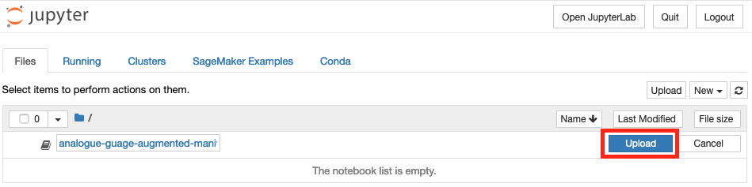
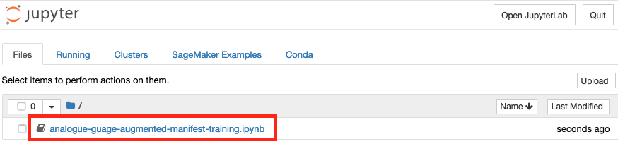
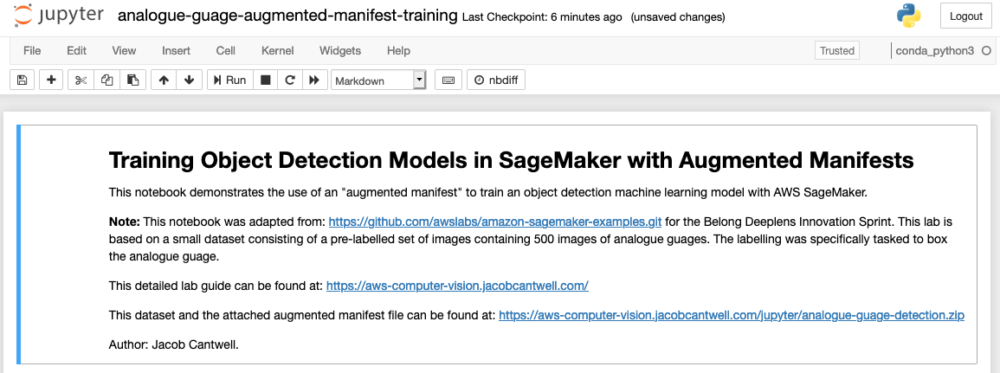

+++
title = "x.2 Jupyter Notebooks"
chapter = true
weight =  20
+++

## x.2 Jupyter Notebooks

In the managed Jupyter notebook console, you can upload Jupyter notebook application files that contain descriptive steps as well as code to execute. You can also use the workspace to upload data for processing and formatting for a Sagemaker training job.

## Load a Jupyter Notebook Application

A prebuilt Jupyter notebook file has been built for this lab.

**Right-click** this [Jupyter-Analogue-Guage-Application](jupyter/analogue-guage-augmented-manifest-training.ipynb) link and select **‘Save Link As’** to download the file to local directory.

### Uploading

In the Jupyter notebook select **Upload** and select the ‘analogue-guage-augmented-manifest-training.ipynb’ file that you just saved locally.

Then click the **Upload** button inline with the file you selected.

Once the file is uploaded, click on the file name:

This will take you to the Jupyter Notebook execution environment, you will get a page similar to the below:

