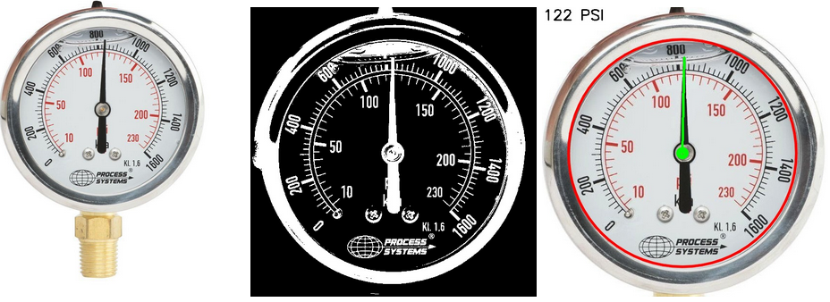

## Read Analogue Gauges With Machine Learning on AWS

The [Read Analogue Gauges With Machine Learning on AWS](https://aws-computer-vision.jacobcantwell.com/) workshop walks you through the end-to-end process for building analogue gauges (real and virtual), generating training data for use with AWS machine learning services including Amazon SageMaker and Amazon Rekognition, building a machine learning model that can detect and read different gauge types, deploying the model on the cloud and on edge devices, converting gauge image data to usable digital telemetry, and presenting the telemetry on a centralized digital dashboard. This end-to-end process can be reused for training your own models for similar machine learning projects.

## Analogue Gauge Builder

Create your own virtual analogue gauges in the [Analogue Gauge Builder](gauge/?g=bp100,bp200,bp50,bp75,bp60,bp100) website.

## Agenda

* Virtual - Send mock AWS analogue telemetry to AWS IoT
* Virtual - Build real time analogue gauges Kibana
* Virtual or Real - Take screen captures of the analog gauges for training data
* Deploy a sample model that can detect a Kibana gauge on a Deeplens camera
* Label the images with Amazon Sagemaker ground truth
* Build a custom model with Sagemaker that can read the gauge values
* Invoke an endpoint client
* View the real time dashboard with dial data
